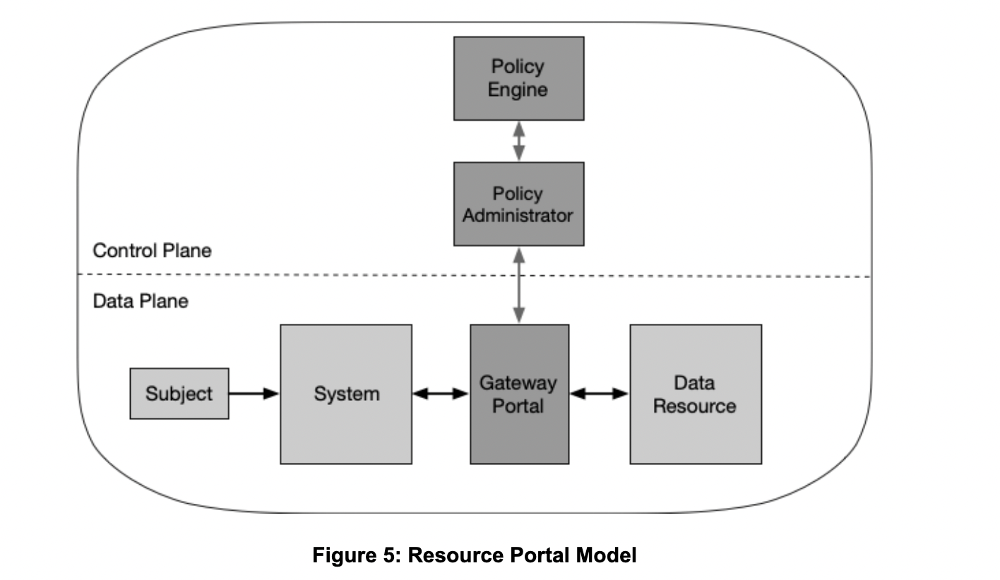

# OPA Test

## Model
This first example is closest to a resource portal-based deployment, except for simplicity, the gateway and resource are on the same server.


## Starting
1. Start OPA: `bash start-opa.sh`
2. Start application server from the /pep folder: `flask run pep/app.py`
3. Test access to the "resource" by providing correct cookies:
```
user: "jack"
role: "authorised"
```